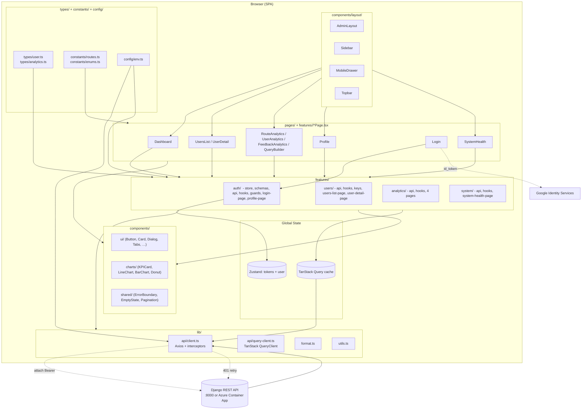
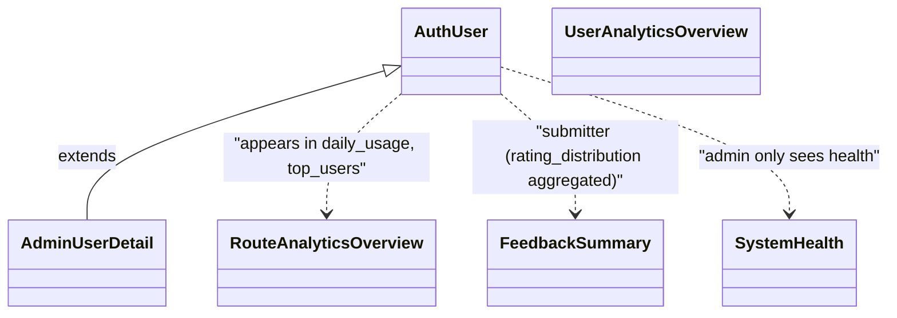
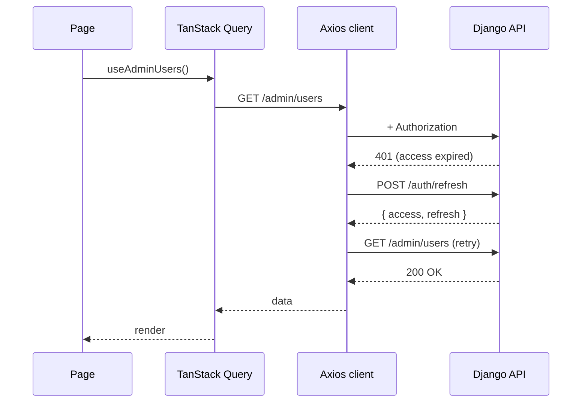
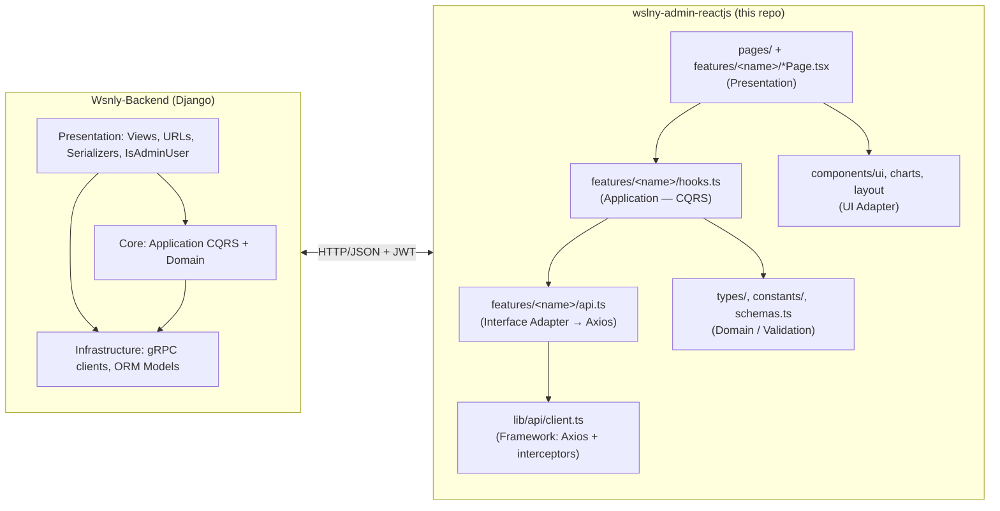

# Wslny Admin Dashboard — Technical Implementation Plan

> **Companion docs**:
> - `.speckit/spec.md` — requirements & user stories
> - `.speckit/constitution.md` — governing principles (tech stack is non-negotiable)
> - `.speckit/tasks.md` — actionable tasks
> - `README.md` (this repo) — operator-facing README
> - `endpoints.json` — backend OpenAPI 3 contract (this repo)
> - [`Wsnly-Backend/README.md`](../Wsnly-Backend/README.md) — backend platform overview
> - [`Wsnly-Backend/docs/`](../Wsnly-Backend/docs/) — full backend docs (`architecture.md`, `authentication.md`, `admin-analytics.md`, …)

---

## 0. Scope Clarification (Admin Panel Only)

This repository is the **Wslny Admin Dashboard** — the operations console for platform operators. It is **not** the end-user / commuter app (which is a separate Flutter / mobile client that talks to the same API).

### 0.1 What this dashboard consumes

Only the **admin and operator-relevant** surface of the backend, grouped by domain:

| Backend Domain | Endpoints in scope | Why |
|---|---|---|
| **Auth (self-service)** | `/api/v1/auth/{login, google-login, refresh, profile, change-password}` | Admin logs in & manages own account |
| **Admin — User Management** | `/api/v1/admin/users`, `/api/v1/admin/users/{id}`, `/api/v1/admin/change-role` | CRUD operators |
| **Admin — Analytics** | `/api/v1/admin/analytics/{routes,users,feedback}/...` | KPIs, charts, query builder |
| **System — Health** | `/api/health` | DB / AI / routing-engine status |

### 0.2 What this dashboard does NOT consume

The backend exposes **end-user** endpoints for the Flutter mobile app. The admin dashboard **must not call** these:

| Excluded Endpoint Group | Owner Client | Reason |
|---|---|---|
| `/api/v1/auth/register` | Mobile (commuter self-registration) | Not needed by an operator who is already seeded |
| `/api/v1/route`, `/api/v1/routes/{search,confirm,alternatives,feedback,metadata}` | Mobile | Trip planning, not admin work |
| `/api/v1/route/history` | Mobile | User's own history |
| `/api/v1/lines`, `/api/v1/lines/{id}` | Mobile | Transit data browser (per spec: read-only here, and only via analytics) |
| `/api/v1/stops/*` | Mobile | Stop lookup |
| `/api/v1/user/{favorites,saved-locations,preferences}` | Mobile | User's own data — admin sees aggregate counts via `/admin/analytics/users/overview` and `/admin/users/{id}` |

> **Spec alignment**: `.speckit/spec.md` §"Out of Scope" explicitly excludes "Map visualization of polylines", "Editing stops/lines (transit data is read-only here)", and "Server-Sent Events / live tail of route requests". This plan respects those constraints.

### 0.3 Backend mirrors Clean Architecture / CQRS

Per [`Wsnly-Backend/docs/architecture.md`](../Wsnly-Backend/docs/architecture.md), the backend's Django layer uses:

- **Presentation** — Views, URLs, Serializers, `IsAdminUser` permission
- **Core (Business Logic)** — `Application/` (Use Cases, **CQRS** Commands/Queries) + `Domain/` (Constants, Errors)
- **Infrastructure** — gRPC clients, Django ORM models

The dashboard's `features/<name>/` folders mirror this: `api.ts` = presentation adapter, `hooks.ts` = application orchestration (queries & mutations), `schemas.ts` = domain validation, `types/` = shared contracts. See §7 below.

---

## 1. Tech Stack

The stack is **locked** by `.speckit/constitution.md` §2 and **already installed** in `package.json`. The table below records the decision, the rationale, and the role each library plays in the architecture. No deviation is permitted without amending the constitution first.

| Concern | Choice | Version | Rationale | Role in Architecture |
|---|---|---|---|---|
| Build tool | **Vite** | ^5.4 | Fastest dev server, ESM-first, tiny prod output via Rollup | Bundles the SPA, lazy-splits per route |
| Framework | **React 18 + TypeScript (strict)** | ^18.3 / ^5.6 | Type safety, ecosystem maturity, concurrent rendering | UI runtime |
| Styling | **Tailwind CSS 3** + **CSS variables** | ^3.4 | Utility-first, locked brand tokens via `hsl(var(--token))` for future dark mode | Theme system + class-based responsive design |
| UI primitives | **shadcn/ui** (Radix + cva + tailwind-merge) | latest | Accessible, headless, fully owned source, no version-lock | `components/ui/` pure presentation layer |
| Routing | **React Router v6** | ^6.28 | De-facto SPA router, supports nested layouts and route guards | `routes.tsx` + `RequireAuth`/`RequireAdmin` guards |
| Server state | **TanStack Query v5** | ^5.59 | Cache, retries, refetch, query invalidation, devtools | All remote data (queries + mutations) |
| Client state | **Zustand (with `persist`)** | ^5.0 | Tiny, no boilerplate, `localStorage` middleware for tokens | `features/auth/store.ts` only |
| Forms | **React Hook Form + Zod + @hookform/resolvers** | ^7.53 / ^3.23 / ^3.9 | Performant, schema-first, type-inferred | All form pages (login, profile, change-role, query-builder) |
| HTTP | **Axios** | ^1.7 | Interceptors, `CancelToken`, request/response middleware | `lib/api/client.ts` |
| Charts | **Recharts** | ^2.13 | Composable, React-native, lazy-loadable | `components/charts/` |
| Icons | **lucide-react** | ^0.460 | Tree-shakeable, consistent stroke | Icon-only buttons + nav |
| Date utils | **date-fns** | ^4.1 | Tree-shakeable | `lib/format.ts` formatters |
| Toasts | **react-hot-toast** | ^2.4 | Lightweight, accessible | Global notifications |
| Fonts | **@fontsource/inter** | ^5.1 | Self-hosted Inter | Typography |
| Package manager | **pnpm** | 9.15 | Deterministic, fast | Dependency install |

> **What we explicitly rejected** (per constitution §2):
> - ❌ **Next.js** — SSR is unnecessary; the dashboard is auth-gated and behind JWT.
> - ❌ **Redux** — overkill; auth lives in Zustand, server state in TanStack Query.
> - ❌ **Material UI / Chakra** — heavy, opinionated; we want full control over the teal brand.

---

## 2. Architecture Diagram

The codebase uses **feature-based modular architecture** (modern React best practice). Domain code never imports UI primitives; UI primitives never call APIs.



### Layer Rules (enforced by ESLint + code review)

| Rule | Why |
|---|---|
| `lib/` never imports from `components/` or `features/` | Keeps pure utilities reusable and free of UI dependencies |
| `components/ui/` is **pure and presentational**; never calls APIs, never reads Zustand | Headless primitives stay testable and reusable |
| `components/layout/` is the only place that imports the router | Single boundary between routing and the rest of the UI |
| `features/<name>/` is self-contained: API, hooks, schemas, page, components | Domain isolation — drop a feature in, drop it out |
| `pages/` is reserved for cross-feature pages (Dashboard, NotFound) | Prevents feature pages from importing each other |
| `types/` is leaf-only; never imports runtime code | Types are pure structural contracts |
| Dependency direction: `pages → features → components → lib → types` | Mirrors Clean Architecture's dependency rule |

---

## 3. Data Model

All entities are **derived from the OpenAPI schemas in `endpoints.json`**. The dashboard never persists locally (except tokens in `localStorage`), so there is no database — the Django backend is the system of record. Entities below are **DTOs**, not domain objects, but they are modelled as immutable TypeScript types with discriminated unions where appropriate.

### 3.1 Auth & User

```ts
// features/auth/store.ts (Zustand state)
// Role strings are **case-sensitive** and match the backend's `IsAdminUser`
// permission class — see Wsnly-Backend/docs/authentication.md §"Roles".
// Capitalised "Admin" / "User" (NOT "admin" / "user") is required.
type Role = 'Admin' | 'User'
type Gender = 'male' | 'female' | null

interface AuthUser {
  id: number
  email: string
  first_name: string
  last_name: string
  mobile_number?: string
  role: Role
  is_active: boolean
  gender?: Gender
  address?: string | null
  date_joined: string  // ISO datetime
}

interface AuthTokens {
  access: string   // JWT, 60 min
  refresh: string  // JWT, 24 h
}

interface AuthState {
  user: AuthUser | null
  tokens: AuthTokens | null
  isAuthenticated: boolean
  setAuth: (user: AuthUser, tokens: AuthTokens) => void
  clear: () => void
}
```

```ts
// types/user.ts — admin-only fields
// Mirrors Wsnly-Backend/docs/admin-analytics.md §"User Detail" exactly.
interface AdminUserDetail extends AuthUser {
  total_routes: number
  saved_locations_count: number
  favorite_routes_count: number
}

interface AdminUserUpdate {
  first_name?: string
  last_name?: string
  mobile_number?: string
  gender?: Gender
  address?: string | null
  role?: Role
  is_active?: boolean
}

// Wsnly-Backend: "Valid roles: Admin, User. Changing to Admin automatically
// grants is_staff and is_superuser." (admin-analytics.md §"Change Role")
interface ChangeUserRoleRequest {
  user_id: number
  new_role: Role
}
```

> **Backend contract note**: The backend `IsAdminUser` permission checks `request.user.role == "Admin"` **case-sensitively**. Our `RequireAdmin` guard must do an exact string match (`user.role === 'Admin'`), never a `toLowerCase() === 'admin'` normalisation.

### 3.2 Analytics

```ts
// types/analytics.ts — read-model DTOs
// Shape mirrors Wsnly-Backend/docs/admin-analytics.md exactly.
type RouteSource = 'map' | 'text'
type RouteStatus = 'success' | 'failed'
type FeedbackRating = 1 | 2 | 3 | 4 | 5
type RouteFilter = 1 | 2 | 3 | 4 | 5 | 6   // optimal|fastest|cheapest|bus_only|microbus_only|metro_only
type RouteFilterName = 'optimal' | 'fastest' | 'cheapest' | 'bus_only' | 'microbus_only' | 'metro_only'

// GET /api/v1/admin/analytics/routes/overview
interface RouteAnalyticsOverview {
  totals: {
    requests: number
    success: number
    failed: number
    success_rate_percent: number
  }
  source_breakdown: { text: number; map: number }
  averages: {
    ai_latency_ms: number
    routing_latency_ms: number
    total_latency_ms: number
    duration_seconds: number
    distance_meters: number
  }
  daily_usage: Array<{ day: string; total: number }>   // ISO date
}

// GET /api/v1/admin/analytics/routes/top-routes
interface RouteTopRoutesResponse {
  top_routes: Array<{
    origin_name: string
    destination_name: string
    requests: number
    avg_duration_seconds: number
    avg_distance_meters: number
  }>
}

// GET /api/v1/admin/analytics/routes/filters
// Note: a single filter is returned per call (the `filter` query param
// scopes the response). Aggregate per-filter by calling repeatedly or
// by using the generic query endpoint with group_by=filter.
interface RouteFilterStatsResponse {
  filter: {
    name: RouteFilterName
    requests: number
    avg_duration_seconds: number
    avg_fare: number
    success_rate_percent: number
  }
}

// GET /api/v1/admin/analytics/routes/unresolved
interface RouteUnresolvedStatsResponse {
  unresolved_reasons: Array<{ unresolved_reason: string; count: number }>
  long_walk_count: number
  top_unresolved_queries: Array<{ input_text: string; error_code: string; count: number }>
}

// GET /api/v1/admin/analytics/users/overview
interface UserAnalyticsOverviewResponse {
  totals: {
    total_users: number
    active_users: number
    inactive_users: number
    admin_users: number
    users_with_routes: number
    avg_routes_per_user: number
  }
  growth: Array<{ day: string; count: number }>
  top_users_by_routes: Array<{
    // Note: Django ORM aggregation keys (double-underscore). Don't rename —
    // they come straight from the backend's `values()` call.
    user__email: string
    user__first_name: string
    route_count: number
    success_count: number
  }>
}

// GET /api/v1/admin/analytics/feedback
interface FeedbackListResponse {
  feedback: Array<{
    id: number
    user_id: number
    user_email: string
    request_id: string
    rating: FeedbackRating
    comment: string
    created_at: string
  }>
  pagination: { total: number; limit: number; offset: number }
}

// GET /api/v1/admin/analytics/feedback/summary
interface FeedbackSummaryResponse {
  total_feedback: number
  average_rating: number
  rating_distribution: Record<'1' | '2' | '3' | '4' | '5', number>
}

// GET /api/health
interface SystemHealth {
  database: 'up' | 'down'
  ai_service: 'up' | 'down'
  routing_engine: 'up' | 'down'
  checked_at: string
}
```

### 3.3 Relationships (read-only view)



> All relationships are **read aggregates** — there is no write coupling between features. This keeps each feature folder self-contained.

### 3.4 Storage Approach

| What | Where | Why |
|---|---|---|
| JWT access + refresh tokens | `localStorage` (key: `auth-storage`) | Survives reloads, cleared on logout. Risk: XSS — mitigated by short access-token TTL + refresh flow. |
| Query cache | In-memory (TanStack Query) | Re-hydrated on each session. Server is source of truth. |
| TanStack Query persistence | Optional `persistQueryClient` to `sessionStorage` for offline-friendly UX on Dashboard | Toggleable feature flag (off by default). |
| User profile | Zustand store, persisted | Quick header avatar hydration on cold load. |
| Nothing else | — | We are a **read-mostly** client. No IndexedDB, no SQLite. |

---

## 4. API Design

The backend API is **fixed** (Django REST, documented in `endpoints.json`). The dashboard's job is to **consume** these contracts faithfully. Below is the **mapping from every endpoint to its UI surface**, grouped by feature.

### 4.1 Endpoint Inventory → UI Mapping

| Endpoint | Method | Feature / Page | Hook | Notes |
|---|---|---|---|---|
| `/api/v1/auth/login` | POST | `features/auth/login-page.tsx` | `useLogin()` mutation | Stores tokens on success |
| `/api/v1/auth/google-login` | POST | `features/auth/login-page.tsx` | `useGoogleLogin()` | Optional; gated on `VITE_GOOGLE_CLIENT_ID` |
| `/api/v1/auth/refresh` | POST | `lib/api/client.ts` interceptor | — | Internal: triggered on 401 |
| `/api/v1/auth/profile` | GET / PUT | `features/auth/profile-page.tsx` | `useProfile()`, `useUpdateProfile()` | Current admin's own profile |
| `/api/v1/auth/change-password` | POST | `features/auth/profile-page.tsx` | `useChangePassword()` | Modal flow |
| `/api/v1/admin/users` | GET | `features/users/users-list-page.tsx` | `useAdminUsers({ search, role, status, page })` | Paginated table |
| `/api/v1/admin/users/{id}` | GET | `features/users/user-detail-page.tsx` | `useAdminUser(id)` | Detail header + stats |
| `/api/v1/admin/users/{id}` | PUT | `features/users/user-detail-page.tsx` | `useUpdateUser(id)` | Edit modal |
| `/api/v1/admin/users/{id}` | DELETE | `features/users/user-detail-page.tsx` | `useDeactivateUser(id)` | Soft delete (optimistic toggle `is_active`) |
| `/api/v1/admin/change-role` | POST | `features/users/user-detail-page.tsx` | `useChangeRole()` | User ↔ Admin |
| `/api/v1/admin/analytics/routes/overview` | GET | `pages/dashboard.tsx`, `features/analytics/route-analytics-page.tsx` | `useRouteOverview(filters)` | KPIs + daily usage chart |
| `/api/v1/admin/analytics/routes/top-routes` | GET | `features/analytics/route-analytics-page.tsx` (Top Routes tab) | `useTopRoutes(filters)` | |
| `/api/v1/admin/analytics/routes/filters` | GET | `features/analytics/route-analytics-page.tsx` (Filters tab) | `useFilterStats(filters)` | |
| `/api/v1/admin/analytics/routes/unresolved` | GET | `features/analytics/route-analytics-page.tsx` (Unresolved tab) | `useUnresolvedStats(filters)` | |
| `/api/v1/admin/analytics/routes/query` | GET | `features/analytics/query-builder-page.tsx` | `useRouteQuery(params)` | Composable metrics + group-by |
| `/api/v1/admin/analytics/users/overview` | GET | `pages/dashboard.tsx`, `features/analytics/user-analytics-page.tsx` | `useUserOverview(filters)` | |
| `/api/v1/admin/analytics/feedback` | GET | `features/analytics/feedback-analytics-page.tsx` | `useFeedbackList({ rating, from_date, to_date, page })` | |
| `/api/v1/admin/analytics/feedback/summary` | GET | `features/analytics/feedback-analytics-page.tsx` | `useFeedbackSummary()` | Average + distribution |
| `/api/health` | GET | `features/system/system-health-page.tsx` | `useSystemHealth()` with `refetchInterval: 30_000` | |

> **Out of scope for v1** (read by mobile app, not by admin): `/api/v1/route/*`, `/api/v1/routes/*`, `/api/v1/lines/*`, `/api/v1/stops/*`, `/api/v1/user/*` (favorites, saved-locations, preferences). They remain documented in `endpoints.json` for reference.

### 4.2 Client-Side Conventions

**Base URL** is taken from `VITE_API_BASE_URL` (validated in `src/config/env.ts`); defaults to `http://localhost:8000` in dev, the Azure Container App in prod.

**Authentication header** is attached by the Axios **request interceptor** in `lib/api/client.ts`:

```ts
apiClient.interceptors.request.use((config) => {
  const token = useAuthStore.getState().tokens?.access
  if (token) config.headers.Authorization = `Bearer ${token}`
  return config
})
```

> **Backend CORS contract** (per `Wsnly-Backend/docs/authentication.md` §"CORS Configuration"): `CORS_ALLOW_CREDENTIALS = True` and origins are env-controlled. Our `VITE_API_BASE_URL` must be one of the allowed origins in production.

**Token refresh flow** (single in-flight promise to avoid the thundering-herd race):



If refresh fails, the **response interceptor** clears the auth store and redirects to `/login` with a `react-hot-toast` message.

**Pagination** is server-side; tables use `limit` + `offset` controlled by `components/shared/pagination.tsx`.

**Validation** uses **Zod** schemas co-located with each form (e.g. `features/auth/schemas.ts`). The same schema could be reused if a BFF were introduced later.

**Error envelope** is `ValidationErrorsResponse` from the OpenAPI spec — typed as `{ field: string[] }`. We map these to React Hook Form field errors.

> **Backend rate limits** (per `Wsnly-Backend/docs/authentication.md` §"Rate Limiting"): 30 req/min anonymous, 60 req/min authenticated, `/api/health` is exempt. Our axios client does not need client-side throttling, but we should display a `429 Too Many Requests` toast if the backend ever returns that status.

---

## 5. File Structure

The structure below **matches what is already in `src/`** (see the `find` output above) and is locked by the README.

```
wslny-admin-reactjs/
├── .speckit/
│   ├── constitution.md
│   ├── spec.md
│   ├── plan.md              ← this file
│   └── tasks.md
├── public/
├── src/
│   ├── main.tsx                     # React entrypoint + StrictMode
│   ├── App.tsx                      # Providers + route tree
│   ├── vite-env.d.ts
│   │
│   ├── styles/
│   │   └── globals.css              # Tailwind layers + shadcn CSS variables + Inter font
│   │
│   ├── components/                  # Cross-feature, presentational
│   │   ├── ui/                      # shadcn primitives — Button, Card, Input, Dialog, Tabs, Select,
│   │   │                            # Checkbox, Switch, Avatar, Badge, Skeleton, Tooltip, Popover,
│   │   │                            # Progress, Separator, DropdownMenu, Textarea, Label
│   │   ├── charts/                  # KPICard, LineChart, BarChart, Donut wrappers around Recharts
│   │   ├── layout/                  # AdminLayout, Sidebar, MobileDrawer, Topbar
│   │   └── shared/                  # ErrorBoundary, ErrorState, EmptyState, PageSpinner, Pagination
│   │
│   ├── features/                    # Business features (one folder per domain)
│   │   ├── auth/
│   │   │   ├── store.ts             # Zustand: tokens, user, isAuthenticated
│   │   │   ├── schemas.ts           # Zod: loginSchema, profileSchema, changePasswordSchema
│   │   │   ├── api.ts               # login(), googleLogin(), refresh(), getProfile(), updateProfile(), changePassword()
│   │   │   ├── hooks.ts             # useLogin, useGoogleLogin, useProfile, useUpdateProfile, useChangePassword
│   │   │   ├── guards.tsx           # <RequireAuth>, <RequireAdmin>
│   │   │   ├── login-page.tsx       # default export
│   │   │   └── profile-page.tsx     # default export
│   │   ├── users/
│   │   │   ├── api.ts               # listUsers, getUser, updateUser, deactivateUser, changeRole
│   │   │   ├── hooks.ts             # useAdminUsers, useAdminUser, useUpdateUser, useDeactivateUser, useChangeRole
│   │   │   ├── keys.ts              # TanStack Query keys factory
│   │   │   ├── users-list-page.tsx
│   │   │   └── user-detail-page.tsx
│   │   ├── analytics/
│   │   │   ├── api.ts               # routeOverview, topRoutes, filterStats, unresolvedStats,
│   │   │   │                       # routeQuery, userOverview, feedbackList, feedbackSummary
│   │   │   ├── hooks.ts             # matching useX hooks
│   │   │   ├── route-analytics-page.tsx     # 4 tabs
│   │   │   ├── user-analytics-page.tsx
│   │   │   ├── feedback-analytics-page.tsx
│   │   │   └── query-builder-page.tsx
│   │   └── system/
│   │       ├── api.ts               # getHealth()
│   │       ├── hooks.ts             # useSystemHealth (refetchInterval 30s)
│   │       └── system-health-page.tsx
│   │
│   ├── pages/                       # Cross-feature pages
│   │   ├── dashboard.tsx
│   │   └── not-found.tsx
│   │
│   ├── lib/                         # Framework-free utilities + API plumbing
│   │   ├── api/
│   │   │   ├── client.ts            # Axios instance + interceptors + refresh queue
│   │   │   └── query-client.ts      # TanStack QueryClient with defaults
│   │   ├── format.ts                # formatDate, formatDuration, formatNumber, formatDistance
│   │   └── utils.ts                 # cn() (clsx + tailwind-merge)
│   │
│   ├── hooks/                       # Generic React hooks
│   │   ├── use-debounce.ts
│   │   └── use-media-query.ts
│   │
│   ├── types/                       # Shared TS types (DTOs from OpenAPI)
│   │   ├── user.ts
│   │   └── analytics.ts
│   │
│   ├── constants/
│   │   ├── routes.ts                # ROUTES constants for React Router
│   │   └── enums.ts                 # ROUTE_FILTERS, ROLES, GENDERS, ROUTE_SOURCES, ROUTE_STATUSES
│   │
│   └── config/
│       └── env.ts                   # Validated env access (VITE_API_BASE_URL, VITE_GOOGLE_CLIENT_ID)
│
├── index.html
├── vite.config.ts
├── tailwind.config.ts
├── postcss.config.js
├── tsconfig.json / tsconfig.app.json / tsconfig.node.json
├── eslint.config.js
├── components.json                  # shadcn/ui config
├── .env / .env.example
├── .gitignore
├── package.json / pnpm-lock.yaml
└── README.md
```

### Why feature-based and not layered?

Layered (`/controllers`, `/services`, `/repositories`) makes sense on the server where the **type of code** is the dominant axis. On a client, the **business domain** dominates — users, analytics, auth, system. Feature folders colocate everything a feature needs, which:
- Makes deletion of a feature a single `rm -rf` operation.
- Minimises cross-feature imports (Liskov-friendly).
- Lets each feature expose **one** page entry point (its default export).
- Mirrors Clean Architecture's "feature slices" pattern.

---

## 6. Dependencies

Listed in `package.json` (versions pinned to ^X.Y.Z):

### Runtime

```
@fontsource/inter             ^5.1.0
@hookform/resolvers           ^3.9.1
@radix-ui/react-avatar        ^1.2.0
@radix-ui/react-checkbox      ^1.3.5
@radix-ui/react-dialog        ^1.1.17
@radix-ui/react-dropdown-menu ^2.1.18
@radix-ui/react-label         ^2.1.10
@radix-ui/react-popover       ^1.1.17
@radix-ui/react-progress      ^1.1.10
@radix-ui/react-select        ^2.3.1
@radix-ui/react-separator     ^1.1.10
@radix-ui/react-slot          ^1.3.0
@radix-ui/react-switch        ^1.3.1
@radix-ui/react-tabs          ^1.1.15
@radix-ui/react-tooltip       ^1.2.10
@tanstack/react-query         ^5.59.20
axios                         ^1.7.7
class-variance-authority      ^0.7.1
clsx                          ^2.1.1
date-fns                      ^4.1.0
lucide-react                  ^0.460.0
react / react-dom             ^18.3.1
react-hook-form               ^7.53.2
react-hot-toast               ^2.4.1
react-router-dom              ^6.28.0
recharts                      ^2.13.3
tailwind-merge                ^2.5.4
tailwindcss-animate           ^1.0.7
zod                           ^3.23.8
zustand                       ^5.0.1
```

### Development

```
@types/node               ^22.9.0
@types/react              ^18.3.12
@types/react-dom          ^18.3.1
@typescript-eslint/*      ^8.14.0
@vitejs/plugin-react      ^4.3.3
autoprefixer              ^10.4.20
eslint                    ^9.14.0
eslint-plugin-react-hooks ^5.0.0
eslint-plugin-react-refresh ^0.4.14
globals                   ^15.12.0
postcss                   ^8.4.49
tailwindcss               ^3.4.14
typescript                ^5.6.3
typescript-eslint         ^8.14.0
vite                      ^5.4.11
```

### NPM Scripts

```
pnpm dev          # vite
pnpm build        # tsc -b && vite build
pnpm lint         # eslint .
pnpm typecheck    # tsc -b --noEmit
pnpm preview      # vite preview
```

---

## 7. Clean-Architecture Framing

Even on the frontend, Clean Architecture's **dependency rule** applies. The mapping is:

| Clean Architecture Layer | React Equivalent in This Project |
|---|---|
| **Domain / Entities** | `types/` (DTOs, value objects, discriminated unions) + `constants/enums.ts` |
| **Use Cases / Application** | `features/<name>/hooks.ts` (one hook per use case) + `features/<name>/schemas.ts` (Zod validation) |
| **Interface Adapters** | `features/<name>/api.ts` (HTTP adapter), `components/ui/` (UI adapter to design system) |
| **Frameworks & Drivers** | React, React Router, TanStack Query, Zustand, Axios, Recharts, Radix |

### 7.1 Mirror of the Backend's Layered Architecture

Per [`Wsnly-Backend/docs/architecture.md`](../Wsnly-Backend/docs/architecture.md) §"Clean Architecture / DDD-lite", the backend splits into Presentation / Core (Application + Domain) / Infrastructure with **CQRS** Commands & Queries. Our frontend mirrors this directly so the two halves stay conceptually aligned:



The **dependency direction is identical** on both sides: outer rings depend on inner rings, never the reverse. A query never mutates; a mutation never returns a list.

### CQRS in the Frontend

The constitution's separation of *commands* and *queries* is honoured by **TanStack Query**'s natural split:

- **Query hooks** (`useX`, `useAdminUsers`, `useRouteOverview`) → read-only, return data, no side effects, declared in `features/<name>/hooks.ts` alongside their keys factory in `keys.ts`.
- **Mutation hooks** (`useUpdateUser`, `useDeactivateUser`, `useChangePassword`) → write-only, return `void`/`Result`, invalidate the relevant query keys on success (`queryClient.invalidateQueries({ queryKey: usersKeys.all })`).

Forbidden patterns (enforced in code review):
- ❌ A query hook that also calls `queryClient.setQueryData` to mutate cache outside its own key.
- ❌ A mutation hook that returns the freshly-updated server payload to the caller *and* optimistically mutates another feature's cache.
- ❌ Sharing a hook across features.

### Domain Isolation

Each `features/<name>/` folder is a **domain boundary**:
- It owns its types (or imports from `types/` if shared).
- It owns its API surface (`api.ts`) and exposes hooks, not raw Axios calls, to pages.
- Its pages never import other features directly — they only consume public hooks and shared types.

This means removing a feature (e.g. `features/system/`) is a self-contained operation: drop the folder, drop the route in `App.tsx`, drop the sidebar entry, drop the `keys.ts` import. Nothing else changes.

### SOLID Mapping

| Principle | How it's applied here |
|---|---|
| **S — Single Responsibility** | One page per feature, one hook per use case, one Zod schema per form, one chart per file |
| **O — Open/Closed** | Adding a new metric to Query Builder = add a checkbox + a row in the metrics enum; no existing code changes |
| **L — Liskov Substitution** | All `AdminUserDetail` values can be passed wherever `AuthUser` is expected (interface widening) |
| **I — Interface Segregation** | `useAdminUsers` and `useAdminUser` are two hooks (not one with optional id), each tailored to its call site |
| **D — Dependency Inversion** | Pages depend on **hook abstractions** (`useAdminUsers`), not on `apiClient` directly. If we ever introduce a mock adapter, pages don't change. |

---

## 8. Implementation Phases

The phases below align with the granular tasks in `.speckit/tasks.md` and the existing scaffolding. They are **ordered for incremental, verifiable delivery**.

### Phase 0 — Foundation (✅ substantially complete)
- Vite + React 18 + TypeScript strict scaffolded
- Tailwind + shadcn CSS-variable theme wired
- ESLint flat config with react-hooks + react-refresh
- `package.json` lockfile generated
- `.env.example` provided

### Phase 1 — Infrastructure Layer (`lib/` + `config/` + `constants/` + `types/`)
1. `lib/api/client.ts` — Axios instance, request interceptor attaches JWT, response interceptor handles 401 with single-flight refresh.
2. `lib/api/query-client.ts` — `staleTime: 30_000`, `retry: 1`, `refetchOnWindowFocus: false`, `refetchOnReconnect: true`.
3. `config/env.ts` — runtime-validates `VITE_API_BASE_URL`; warns if `VITE_GOOGLE_CLIENT_ID` is missing.
4. `constants/{routes,enums}.ts` — frozen-as-const objects for `ROUTES`, `ROUTE_FILTERS`, `ROLES`, etc.
5. `types/{user,analytics}.ts` — DTOs derived from OpenAPI.

### Phase 2 — Design System (`components/ui/` + `styles/`)
- All shadcn primitives (Button, Card, Input, Dialog, Tabs, Select, Checkbox, Switch, Avatar, Badge, Skeleton, Tooltip, Popover, Progress, Separator, DropdownMenu, Textarea, Label).
- `components/charts/` — `KPICard`, `LineChartCard`, `BarChartCard`, `DonutChart` (thin Recharts wrappers).
- `components/shared/` — `ErrorBoundary`, `ErrorState`, `EmptyState`, `PageSpinner`, `Pagination`.
- `components/layout/` — `AdminLayout`, `Sidebar` (desktop persistent), `MobileDrawer` (slide-in + overlay + body-scroll lock), `Topbar` (hamburger + page title + avatar dropdown).

### Phase 3 — Auth Feature (`features/auth/`)
1. `store.ts` — Zustand with `persist` middleware (localStorage key `auth-storage`).
2. `schemas.ts` — Zod schemas for login, change-password, profile-update.
3. `api.ts` — typed wrappers for the 5 auth endpoints.
4. `guards.tsx` — `RequireAuth` (any authenticated user) and `RequireAdmin` (must match backend's `IsAdminUser` permission check: `user.role === 'Admin'` **case-sensitively**, per [`Wsnly-Backend/docs/authentication.md`](../Wsnly-Backend/docs/authentication.md) §"Admin Check"). Both guards redirect to `/login` with a `react-hot-toast` message on failure.
5. `login-page.tsx` — email/password form + Google button (conditionally rendered when `VITE_GOOGLE_CLIENT_ID` is set; see R2 in §9).
6. `profile-page.tsx` — profile view + Edit modal + Change Password modal.

### Phase 4 — Users Feature (`features/users/`)
1. `api.ts` + `hooks.ts` + `keys.ts` — list/get/update/deactivate/changeRole.
2. `users-list-page.tsx` — paginated, searchable table; role + status filters; mobile card view.
3. `user-detail-page.tsx` — header + 3 stat cards + Edit modal + Role select + Danger Zone (deactivate).

### Phase 5 — Analytics Feature (`features/analytics/`)
1. `api.ts` + `hooks.ts` — all 8 analytics endpoints.
2. `route-analytics-page.tsx` — 4 tabs (Overview, Top Routes, Filters, Unresolved) sharing filter bar.
3. `user-analytics-page.tsx` — totals + growth chart + top users.
4. `feedback-analytics-page.tsx` — list + summary + distribution bar chart.
5. `query-builder-page.tsx` — form (metrics multi-select + group-by multi-select + sort + order + limit) → table; displays exact request URL.

### Phase 6 — System Feature (`features/system/`)
1. `api.ts` + `hooks.ts` — `useSystemHealth()` with `refetchInterval: 30_000`.
2. `system-health-page.tsx` — 3 status pills (DB, AI, Routing) + last-checked timestamp + manual refresh.

### Phase 7 — Cross-Feature Pages (`pages/`)
1. `dashboard.tsx` — 4 KPI cards + daily-usage line chart + source-breakdown donut; pulls from `analytics` feature hooks.
2. `not-found.tsx` — friendly 404 with "Go home" CTA.

### Phase 8 — Polish & Verification
- Loading skeletons on every async page.
- Error toasts wired through `react-hot-toast`.
- Mobile QA pass at 375 / 768 / 1024 / 1440.
- `pnpm typecheck && pnpm lint && pnpm build` all green.
- Bundle-size check: initial route < 350 KB gzipped (Recharts is lazy-loaded).

---

## 9. Risks and Mitigations

| # | Risk | Likelihood | Impact | Mitigation |
|---|---|---|---|---|
| R1 | Backend offline during frontend development | M | M | `.env.example` defaults to `http://localhost:8000`; backend can be replaced by a tiny `msw` mock layer **only in tests** (no production mock). Documented in README "Getting Started". |
| R2 | Google OAuth requires a real `VITE_GOOGLE_CLIENT_ID` | M | L | Google button is **conditionally rendered** when the env var is present; login page works fully via email/password otherwise. README notes this. |
| R3 | Recharts inflates the bundle | M | M | Lazy-load `components/charts/` via `React.lazy` (already done for chart-rendering pages); Recharts doesn't ship in the initial route's bundle. |
| R4 | Multiple 401s trigger parallel refresh requests → refresh-token race | M | H | **Single-flight refresh promise** cached in module scope; concurrent 401s await the same promise. Verified by unit test. |
| R5 | Token exposure via XSS (`localStorage`) | L | H | Short access-token TTL (60 min), `httpOnly` cookies are the only true fix (out of scope for this client-only dashboard). Defence-in-depth: never `dangerouslySetInnerHTML`, strict CSP recommended for the host page. |
| R6 | Large analytics datasets choke the UI | M | M | All analytics calls are server-paginated; the Query Builder is capped at `limit ≤ 200` (matches the backend's validation per `endpoints.json`). |
| R7 | Mobile drawer body-scroll bleed | L | L | `MobileDrawer` locks `document.body.style.overflow` on open and restores on close + on unmount (cleanup in `useEffect`). |
| R8 | Type drift between frontend and backend | M | M | Types live in `src/types/` mirroring OpenAPI schemas in `endpoints.json`; if the backend changes a DTO shape, TypeScript catches it at build time. Optionally generate types via `openapi-typescript` (CI step) so `src/types/` is regenerated from the backend's `/api/schema/` on every build. |
| R9 | Hidden ESLint regressions after adding dependencies | L | M | `pnpm lint` is part of the Definition of Done. ESLint flat config explicitly enables `react-hooks` and `react-refresh`. |
| R10 | Charts misaligned on dark backgrounds (if dark mode is added later) | L | L | All chart colours are read from CSS variables (`var(--chart-1)` … `var(--chart-5)`); toggle dark mode → charts re-skin. |
| R11 | **Scope creep — accidentally consuming end-user endpoints** (e.g. `/api/v1/route`, `/api/v1/user/favorites`) | M | H | Explicit allow-list in `lib/api/client.ts` (or a lint rule) blocks calls to non-admin paths. The plan §0 enumerates what's in/out of scope; any new endpoint added must first be cleared against the spec. |
| R12 | **Role-case mismatch** with backend `IsAdminUser` (e.g. normalising `'admin'` lowercased) | L | H | `RequireAdmin` guard uses **case-sensitive** equality `user.role === 'Admin'`. Documented in Phase 3 + types section. A unit test asserts the exact strings. |
| R13 | **429 Too Many Requests** from the 60 req/min limit affecting chart refresh | L | M | System Health uses `refetchInterval: 30s`; on 429 the client shows a toast and bumps the interval. Per-endpoint back-off can be added if observed. |

---

## 10. Testing Strategy

The constitution (Definition of Done) demands *build clean* + *lint clean*. The testing strategy is **pragmatic** — full unit + integration coverage for the logic-heavy boundaries, visual QA for the rest.

### 10.1 Unit Tests (Vitest)
- **`lib/api/client.ts`** — Axios interceptors, single-flight refresh, 401 retry, logout on refresh failure.
- **`features/auth/store.ts`** — Zustand actions + `persist` middleware round-trip.
- **`features/auth/schemas.ts`** — Zod validation cases (empty email, weak password, mismatched confirmation, etc.).
- **`features/users/hooks.ts`** — query keys factory shape, invalidation on mutate.
- **`lib/format.ts`** — date, duration, distance, number formatters (locale edge cases).
- **`hooks/use-debounce.ts`**, **`hooks/use-media-query.ts`** — timing & SSR-safety.

### 10.2 Component Tests (Vitest + Testing Library)
- `components/ui/` primitives — render, click, keyboard.
- `features/auth/login-page.tsx` — submits credentials, shows toast on 401, redirects on success.
- `features/users/users-list-page.tsx` — renders rows, pagination, search filter, mobile card mode.
- `components/shared/error-boundary.tsx` — recovers via "Try again".

### 10.3 Integration Tests (MSW — Mock Service Worker)
- Login flow → token stored → refresh → second protected call succeeds.
- Admin user CRUD: list, get, update (PUT), deactivate (DELETE soft), change-role.
- Analytics end-to-end for **each** of the 8 endpoints (response fixtures → component renders → assertions).

### 10.4 End-to-End (Playwright — manual CI trigger, not blocking)
- Smoke: login → land on dashboard → see KPIs (mocked analytics).
- Users: filter, paginate, edit, change role, deactivate.
- Profile: update fields + change password.
- System Health: pills render, refresh button works.

### 10.5 Visual / Responsive QA
- Manual screenshot pass at **375 / 768 / 1024 / 1440** for each page.
- `npm-run-all` script: `pnpm typecheck && pnpm lint && pnpm build && pnpm test` is the pre-commit gate (locally; CI in a future iteration).

### 10.6 Quality Gates (Definition of Done, from constitution §11)
1. Route is accessible and protected.
2. Page renders with real (or mocked) data.
3. Loading + error + empty states all designed.
4. Works at 375 / 768 / 1024 / 1440.
5. No console errors or warnings.
6. `pnpm build` succeeds.
7. `pnpm lint` passes.
8. `pnpm typecheck` passes.

---

## 11. Hosting & Deployment Target

- **Build artefact**: `dist/` produced by `pnpm build` (static SPA).
- **Hosting**: any static host (Vercel, Netlify, Azure Static Web Apps, Nginx). No SSR runtime required.
- **Env injection**: `VITE_API_BASE_URL` must be set at build time (baked into the bundle). For multiple environments, use the host's per-env build variables.
- **Backend**: Django REST API is documented in `endpoints.json` and deployed at `https://wslny-api.icyforest-4fb366f4.uaenorth.azurecontainerapps.io` per `.env`.
- **CORS**: backend must allow the deployed origin; the dev backend (`:8000`) already allows `:5173`.
- **Auth**: dashboard relies on the backend's CORS headers + JWT; no service worker / no offline mode in v1.

---

## 12. Open Questions / Future Considerations

These are **explicitly out of scope** for v1 (per spec §"Out of Scope"), but tracked here so future iterations don't lose context:

1. **Dark mode** — CSS variables are already in place; flip `darkMode: ['class']` and add the dark token set.
2. **Internationalisation** — copy lives inline in components; i18next would be the natural addition.
3. **Generated types from OpenAPI** — `openapi-typescript` against `endpoints.json` would eliminate manual DTO drift and supersede `src/types/`.
4. **PersistQueryClient** — survives page reloads for offline-friendly dashboard viewing.
5. **Service-worker / PWA** — out of scope; admin tool assumes connectivity.
6. **Storybook** — would make `components/ui/` consumable by other apps; not needed yet.

---

*Plan authored against `.speckit/spec.md` and `.speckit/constitution.md`, with the live OpenAPI contract in `endpoints.json` and the backend architecture documented in [`Wsnly-Backend/docs/`](../Wsnly-Backend/docs/). Any deviation from this plan requires an amendment to the constitution first.*
